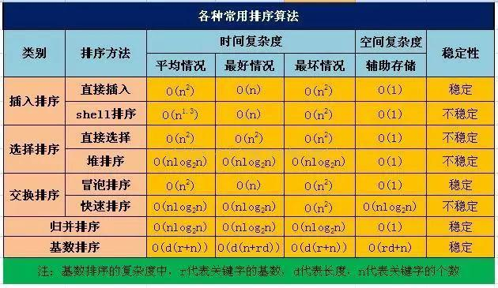
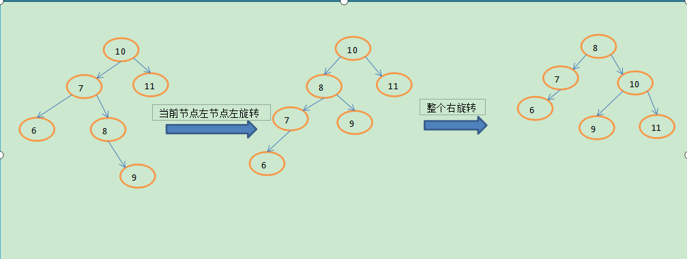

- 注意test里面更改后需要重新的mvn install 一下
## 数据结构

- <font color=red> **稀疏数组（Sparsearray)**：</font>
  （行不固定，列固定3列。第一行是行数、列数、有效数据个数。真正的数据记录是从第二行开始）
- 二维数组转稀疏数组的思路 
  1. 遍历 原始的二维数组，得到有效的数据的个数
  2. 根据sum就可以创建稀疏数组 int[sum+1][3]。（稀疏数组的列固定为3列） 
  3. 将二维数组中有效数据存放进稀疏数组里面。（对应的行号、列号、值）
```

如
原始的二维数组~~
0	0	0	0	0	0	0	0	0	0	0	
0	0	1	0	0	0	0	0	0	0	0	
0	0	0	2	0	0	0	0	0	0	0	
0	0	0	0	0	0	0	0	0	0	0	
0	0	0	0	0	2	0	0	0	0	0	
0	0	0	0	0	0	0	0	0	0	0	
0	0	0	0	0	0	0	0	0	0	0	
0	0	0	0	0	0	0	0	0	0	0	
0	0	0	0	0	0	0	0	0	0	0	
0	0	0	0	0	0	0	0	0	0	0	
0	0	0	0	0	0	0	0	0	0	0	

稀疏数组
得到稀疏数组为~~~~
11	11	3	
1	2	1	
2	3	2	
4	5	2	

```

- <font color=red> **数组模拟队列（ArrayQueue）**：</font>
  - 注意标注队首、队尾、最大的容量

- 用数组模拟环形队列（CircleArrayQueue）
  - 注意其中的几个精妙的算法，如何知道队列满和空，怎么取值，怎么进行下标的移动
  
- <font color=red> **链表**：</font>
  - 单链表(只能一个方向一个一个遍历，不能实现自我删除，只能找到后面节点然后指向这个节点)：
  - 注意2种类型：1、无序添加 2、按照序号进行添加SingleLinkedList
  - 单链表（BAT的面试题，有难度）：1、获取列表的节点个数。2、查找单链表中的倒数第k个结点
    【新浪面试题】 3、将单链表反转 4、逆序打印
  - 双向链表：doublelinklist
    - 烧脑：如何在一个双向链表的指定位置增加一个节点。插入头、尾、中间addBySite方法
        双向链表的测试
        HeroNode [no=1, name=宋江, nickname=及时雨]
        HeroNode [no=2, name=卢俊义, nickname=玉麒麟]
        HeroNode [no=3, name=吴用, nickname=智多星]
        HeroNode [no=4, name=林冲, nickname=豹子头]
        插入末尾后情况~~
        HeroNode [no=1, name=宋江, nickname=及时雨]
        HeroNode [no=2, name=卢俊义, nickname=玉麒麟]
        HeroNode [no=3, name=吴用, nickname=智多星]
        HeroNode [no=4, name=林冲, nickname=豹子头]
        HeroNode [no=5, name=last, nickname=队尾]
        插入队首后情况~~
        HeroNode [no=5, name=first, nickname=队首]
        HeroNode [no=1, name=宋江, nickname=及时雨]
        HeroNode [no=2, name=卢俊义, nickname=玉麒麟]
        HeroNode [no=3, name=吴用, nickname=智多星]
        HeroNode [no=4, name=林冲, nickname=豹子头]
        HeroNode [no=5, name=last, nickname=队尾]
        指定位置后的链表情况~~
        HeroNode [no=5, name=first, nickname=队首]
        HeroNode [no=1, name=宋江, nickname=及时雨]
        HeroNode [no=2, name=卢俊义, nickname=玉麒麟]
        HeroNode [no=3, name=吴用, nickname=智多星]
        HeroNode [no=5, name=center, nickname=中间]
        HeroNode [no=4, name=林冲, nickname=豹子头]
        HeroNode [no=5, name=last, nickname=队尾]
    
  - 约瑟夫环 CircleSingleLinkedList
  - 数组模拟栈，计算表达式的值ArrayStack2 
    - 前缀表达式：波兰表达式。运算符位于操作数之前. 
        - 比如 -*+ 3456。
        - 规则是：从右向左进行扫描。遇到数字压入栈，遇到符号，弹出栈顶的两个数进行计算后，结果再入栈。
    - 中缀表达式：(3 +4)*5-6。常见的写法
    - 后缀表达式：逆波兰表达式。运算符在操作数之后 
      -   规则：从左到右进行扫描。遇到数字压入栈。遇到符号，弹出栈顶的两个数进行计算后，结果入栈。
        - 比如：34+5*6-
        - a+b-->ab+
        - a+(b-c)--> abc-+
        - a-(b-c)*d--> abc-d*+
        - a+d*(b-c)--> adbc-*+
        - a=1+3--> a13+=
    -  //完成对逆波兰表达式的运算 
       1. 从左至右扫描，将3和4压入堆栈；
       2. 遇到+运算符，因此弹出4和3（4为栈顶元素，3为次顶元素），计算出3+4的值，得7，再将7入栈；
       3. 将5入栈；	
       4. 接下来是×运算符，因此弹出5和7，计算出7×5=35，将35入栈； 
       5. 将6入栈； 
       6. 最后是-运算符，计算出35-6的值，即29，由此得出最终结果 */
       
    - 中缀表达式转换后缀表达式步骤PolandNotation中的parseSuffixExpreesionList方法，注意先要转换成对应的list（toInfixExpressionList方法）
    - 完整的逆波兰表达式的计算器，支持小数点和空格符等ReversePolishMultiCalc
    
  
-  <font color=red> **递归（Recursive）**：</font>
  
-  <font color=red> **排序（9种）**：</font>
   - 插入排序 直接插入 InsertSort 
   - 希尔排序
      ShellSort（插入排序的升级版本，防止出现最小的在最后的情况）
   - 选择排序 
        -  简单选择排序 SelectSort 
        -  堆排序（跟二叉树相关）
   - 交换排序 
        - 冒泡排序 bubbleSort 
        - 快速排序 QuickSort （递归，冒泡的升级版本，空间换时间，时间很快）
   - 归并排序 (速度跟快速排序差不多，也很快)(MergetSort)
   - 桶排序BarrelSort   速度也非常快，但是因为要创建一些多余的桶，浪费空间。所以出现基数排序，升级版本
   - 基数排序 (非常快，但是可能会内存溢出。因为是空间换时间)（RadixSort）将整数按照位数进行切割成不同的数字，然后按照每个位数分别比较。很神奇
   
- 算法的时间复杂度
  - 时间频度：一个算法花费的时间与算法中语句的执行的次数成正比，那个算法语句中执行的次数多，那就花费时间多。
    - 一个算法中语句执行的次数成为时间频度。
      


- <font color=red> **查找算法**：</font>
  - 顺序（线性）查找 seqSearch
  - 二分查找/折半查找 BinarySearch
  - 插值查找 二分查找的升级版本 InsertValueSearch，查找中间值的算法比较牛逼
  - 斐波那契查找（黄金分割点）  FibonacciSearch

- hash算法 HashTable

- <font color=red> **二叉树遍历**：</font>
  按照输出的顺序。主要看父节点的输出是在前还是中还是后
  - 前序： 父节点、左子树、右子树
  - 中序： 左子树、父节点、右子树
  - 后序： 左子树、右子树、父节点
  - BinaryTreeTest中实现非排序的二叉树的遍历和二叉树的节点删除，包括删除叶子节点
    以及将叶子子节点进行拼接上去。（有右节点就添加，没有就添加左节点，都没有就直接删除）

- <font color=red> **顺序存储二叉树**：</font>
  -   从存储方式来看，数组和树是可以互相转换的 (ArrBinaryTree)
  -   要求以数组的方式存储，并且在遍历数组的时候，依然可以按照前序、中序、后续的方式完成节点的遍历
  -   顺序二叉树，通常只考虑完全二叉树（所有的叶子节点都是连续，没有中断的）
  -   第n个元素的左子节点为2*n+1 (括号里面的数)
  -   第n个元素的右子节点为2*n+2 (括号里面的数)
  -   第n个元素的父节点为（n-1）/2 (括号里面的数)
  -   编号都是以0开始编号的 
  ```
           1 (0)
            /   \            数组编号：0 1 2 3 4 5 6 
         2(1)   3(2)         对应数组：1 2 3 4 5 6 7
        /   \    /  \
      4(3) 5(4) 6(5) 7(6)
  ```
  
- <font color=red> **线索化二叉树**：</font> ThreadedBinaryTree
  -   n个节点的二叉链表中含有n+1  
      【公式2n-(n-1)=n+1】个空指针域。利用二叉链表中的空指针域，存放指向该节点在某种遍历次序下的前驱和后继节点的指针（这种附加指针成为线索）。
      如下面的就是6+1=7个空指针域 （8，10，14各有连个指针没有指向 6有一个）
  -   加上了线索的二叉链表称为线索链表，相应的二叉树称为线索二叉树。分为前序线索二叉树、中序线索二叉树、后序线索二叉树
  -   一个节点的前一个节点，称为前驱节点  
  -   一个节点的后一个节点，称为后继节点  
  -   线索化后的二叉树，节点可能指向的是前驱或者后继节点，也有可能指向的是本身的二叉树的节点
  ```
             1
           /    \
          3      6      数组：1，3，6，8，10，14
         / \    /       如果进行中序遍历，得到数组： 8，3，10，1，14，6    (3的前驱节点是1，3的后继节点是10。)
        8  10  14
         
  ```
  -    对于线索化二叉树的遍历，前序和中序差不多，后序复杂。需要在创建二叉树的时候，就要将节点的上级节点进行记录才行。
       具体可见ThreadedBinaryTreeTest

  -  二叉树的应用
     -  堆排序（HeapSort）


  ###  排序算法总结
  1. 首先，排序算法的稳定性大家应该都知道，通俗地讲就是能保证排序前2个相等的数其在序列的前后位置顺序和排序后它们两个的前后位置顺序相同。
     在简单形式化一下，如果Ai = Aj，Ai原来在位置前，排序后Ai还是要在Aj位置前。
     
  2. 其次，说一下稳定性的好处。排序算法如果是稳定的，那么从一个键上排序，然后再从另一个键上排序，第一个键排序的结果可以为第二个键排序所用。
     基数排序就是这样，先按低位排序，逐次按高位排序，低位相同的元素其顺序再高位也相同时是不会改变的。
     另外，如果排序算法稳定，对基于比较的排序算法而言，元素交换的次数可能会少一些（个人感觉，没有证实）。
     
     
     
     
     

<font color=red>**(1)冒泡排序（稳定）**</font>  
冒泡排序就是把小的元素往前调或者把大的元素往后调。比较是相邻的两个元素比较，交换也发生在这两个元素之间。
所以，如果两个元素相等，我想你是不会再无聊地把他们俩交换一下的；
如果两个相等的元素没有相邻，那么即使通过前面的两两交换把两个相邻起来，这时候也不会交换，所以相同元素的前后顺序并没有改变，所以冒泡排序是一种稳定排序算法。
     
<font color=red>**(2)选择排序（不稳定）**</font>  
选择排序是给每个位置选择当前元素最小的，
比如给第一个位置选择最小的，在剩余元素里面给第二个元素选择第二小的，依次类推，直到第n-
1个元素，第n个元素不用选择了，因为只剩下它一个最大的元素了。
那么，在一趟选择，如果当前元素比一个元素小，而该小的元素又出现在一个和当前元素相等的元素后面，那么交换后稳定性就被破坏了。
比较拗口，举个例子，序列5 8 5 2
9，我们知道第一遍选择第1个元素5会和2交换，那么原序列中2个5的相对前后顺序就被破坏了，所以选择排序不是一个稳定的排序算法。
     
<font color=red>**(3)插入排序（稳定）**</font>  
插入排序是在一个已经有序的小序列的基础上，一次插入一个元素。
当然，刚开始这个有序的小序列只有1个元素，就是第一个元素。
比较是从有序序列的末尾开始，也就是想要插入的元素和已经有序的最大者开始比起，如果比它大则直接插入在其后面，否则一直往前找直到找到它该插入的位置。
如果碰见一个和插入元素相等的，那么插入元素把想插入的元素放在相等元素的后面。所以，相等元素的前后顺序没有改变，从原无序序列出去的顺序就是排好序后的顺序，所以插入排序是稳定的。
     
<font color=red>**(4)快速排序（不稳定）**</font>  
快速排序有两个方向，左边的i下标一直往右走，当a[i] <=
a[center_index]，其中center_index是中枢元素的数组下标，一般取为数组第0个元素。
而右边的j下标一直往左走，当a[j] > a[center_index]。如果i和j都走不动了，i <=
j，交换a[i]和a[j],重复上面的过程，直到i > j。
交换a[j]和a[center_index]，完成一趟快速排序。
在中枢元素和a[j]交换的时候，很有可能把前面的元素的稳定性打乱， 比如序列为5 3 3 4
3 8 9 10
11，现在中枢元素5和3（第5个元素，下标从1开始计）交换就会把元素3的稳定性打乱，
所以快速排序是一个不稳定的排序算法，不稳定发生在中枢元素和a[j] 交换的时刻。
     
<font color=red>**(5)归并排序（稳定）**</font>  
归并排序是把序列递归地分成短序列，递归出口是短序列只有1个元素（认为直接有序）或者2个序列（1次比较和交换），然后把各个有序的段序列合并成一个有序的长序列，不断合并直到原序列全部排好序。
可以发现，在1个或2个元素时，1个元素不会交换，2个元素如果大小相等也没有人故意交换，这不会破坏稳定性。
那么，在短的有序序列合并的过程中，稳定是是否受到破坏？没有，合并过程中我们可以保证如果两个当前元素相等时，我们把处在前面的序列的元素保存在结果序列的前面，这样就保证了稳定性。
所以，归并排序也是稳定的排序算法。
     
<font color=red>**(6)基数排序（稳定）**</font>  
基数排序是按照低位先排序，然后收集；
再按照高位排序，然后再收集；依次类推，直到最高位。
有时候有些属性是有优先级顺序的，先按低优先级排序，再按高优先级排序，最后的次序就是高优先级高的在前，高优先级相同的低优先级高的在前。
基数排序基于分别排序，分别收集，所以其是稳定的排序算法。
     
 <font color=red>**(7)希尔排序(shell)(不稳定)**</font>  
 希尔排序是按照不同步长对元素进行插入排序，当刚开始元素很无序的时候，步长最大，所以插入排序的元素个数很少，速度很快；
 当元素基本有序了，步长很小， 插入排序对于有序的序列效率很高。
 所以，希尔排序的时间复杂度会比O(n^2)好一些。
 由于多次插入排序，我们知道一次插入排序是稳定的，不会改变相同元素的相对顺序，但在不同的插入排序过程中，相同的元素可能在各自的插入排序中移动，最后其稳定性就会被打乱，
 所以shell排序是不稳定的。
     
 <font color=red>**(8)堆排序（不稳定）**</font>  
 我们知道堆的结构是节点i的孩子为2 * i和2 * i +
 1节点，大顶堆要求父节点大于等于其2个子节点，小顶堆要求父节点小于等于其2个子节点。
 在一个长为n
 的序列，堆排序的过程是从第n/2开始和其子节点共3个值选择最大（大顶堆）或者最小（小顶堆），这3个元素之间的选择当然不会破坏稳定性。
 但当为n/ 2 - 1， n / 2 - 2， ...1这些个父节点选择元素时，就会破坏稳定性。
 有可能第n/2个父节点交换把后面一个元素交换过去了，而第n/2-1个父节点把后面一个相同的元素没
 有交换，那么这2个相同的元素之间的稳定性就被破坏了。
 所以，堆排序不是稳定的排序算法。
     
  综上，得出结论: <font
  color=red>**选择排序、快速排序、希尔排序、堆排序不是稳定的排序算法，而冒泡排序、插入排序、归并排序和基数排序是稳定的排序算法**</font>    
  不稳定的排序算法有：<font
  color=red>**快、希、选、堆。（记忆：找到工作就可以“快些选一堆”美女来玩了（并不能））**</font>
     
  ### 常用排序算法 
  - 见1.jpg  

  - 

    
    
    
  ### 霍夫曼树 
-    给定n个权值作为n个叶子节点，构造一颗二叉树。若该树的带权路径长度（wpl）达到最小，就是最优二叉树，也是霍夫曼树
-    霍夫曼树是带权路径长度最短的树，权值较大的结点离根较近。
- 基本概念 
1.  路径：在一棵树中，从一个节点往下可以达到的孩子或者孙子节点之间的通路
2.  路径长度：通路中分支数目为路径长度。规定根节点的层数为1，则从根节点到第L层的路径长度为L-1
3.  结点的权：若将树中节点赋给一个有着某种含义的数值，则这个数值成为该节点的权。
4.  结点的带权路径长度：从根节点到该节点之间的路径长度与该结点权的乘积。
5.  树的带权路径长度：所有叶子结点的带权路径长度之和。记为WPL。权值越大的结点离根节点越近的二叉树才是最优二叉树。
6.  WPL最小的就是霍夫曼树。

- 构成霍夫曼树的步骤
1. 从小到大进行排序，将每个数据，每个数据都是一个结点，每个结点可以看成一个最简单的二叉树
2. 取出根节点权值最小的两颗二叉树，根节点就是权值之和
3. 组成一颗新的二叉树。该新的二叉树的根节点的权值是前面两颗二叉树根节点权值之和
4. 再将这颗新的二叉树，以根节点的权值大小再次排序。不断重复1-2-3-4的步骤，直到数列中，所有的数据都被处理。就得到霍夫曼树
  
    
 ### 二叉排序树 
 - 二叉排序树（Binary Sort Tree），又称二叉查找树（Binary Search Tree），也称二叉搜索树。
 -  二叉排序树或者是一棵空树，或者是具有下列性质的二叉树：
    （1）若左子树不空，则左子树上所有结点的值均小于或等于它的根结点的值；
    （2）若右子树不空，则右子树上所有结点的值均大于或等于它的根结点的值；
    （3）左、右子树也分别为二叉排序树；
    对于二叉排序树的任何一个非叶子节点，要求左子节点的值比当前节点小，右子节点的值比当前节点大。如果相同，放在左和右都是可以的。
    
    
### 平衡二叉树（AVL树）
- 问题：如果出现一个数组[1,2,3,4,5,6,7]，则二叉排序树则是只有右边节点，左边节点为空，更像一个单链表。
  1. 插入的速度没有影响
  2. 查询速度明显降低，因为要判断左子树，比单链表还慢
- 解决办法： 平衡二叉树（AVL） 
  1. 也叫平衡二叉搜索树，保证查询的效率高
  2. 具备特点：是一个空树 或者它的左右两个子树的高度差的绝对值不超过1，并且左右两个子树都是一颗平衡二叉树。
  3. 常用的使用方法：红黑树、AVL、替罪羊树、Treap、伸展树。左旋转，右旋转，左右旋转。

  双旋转： 当符合右旋转的时候，如果左子树的右子树的高度大于右子树的高度的时候
  1. 先对当前节点的左节点进行左旋转
  
  2. 再对当前节点进行右旋转 
  
     如 
  
     


​    
​    
​    
​    
​    
​    
​    
 

​       